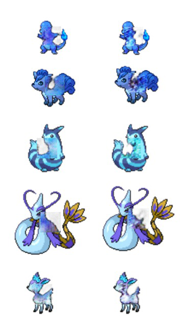

# Gradient-Channel

## Abstract
Generative adversarial networks is a powerful generative model and recently many works have successfully utilized it to generate synthetic imagery that could confuse human subjects.  Although it is an effective tool for learning complex data distribution, how to influence its learning remains largely an open research problem. Here, we propose using classical histogram statistics to guide the learning via an additional image gradient channel. A novel image gradient loss that utilizes the new channel is also presented to better approximate the global statistic for a context encoder. We will empirically show that our method yields improvement, specifically for cartoon characters. Additionally, we will propose using image gradient as a useful global statistic for differentiating carton and photorealism in the cartoon-photorealism continuum.  It is believed that the image gradient channel and histogram statistic is useful in encouraging the generative adversarial networks in producing results more in line with the style of the training data.

# Result Samples

Left is result using gradient channel and right is without. We can see that the one with gradient channel is more in line with the originally style.

## Inputing Data
Create the following directories from the root:
For training data: ProjsStorage/GradientChannel/data/set/train 
For testing data: ProjsStorage/GradientChannel/data/set/test
